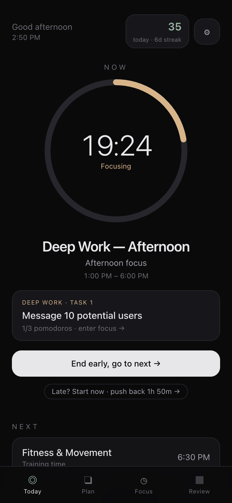
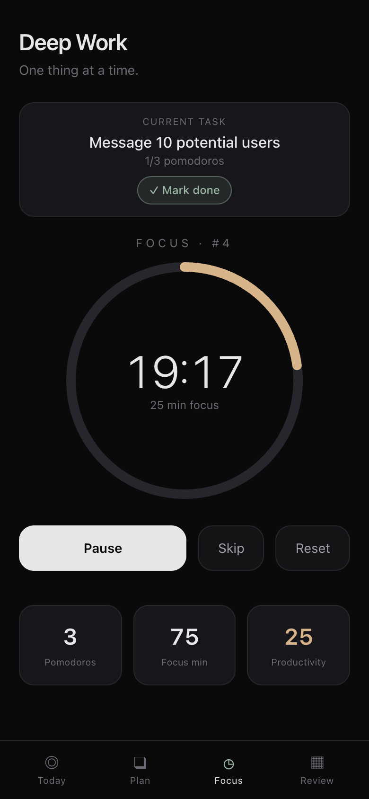
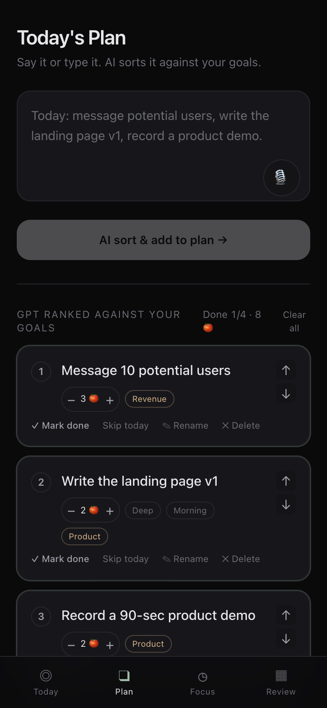
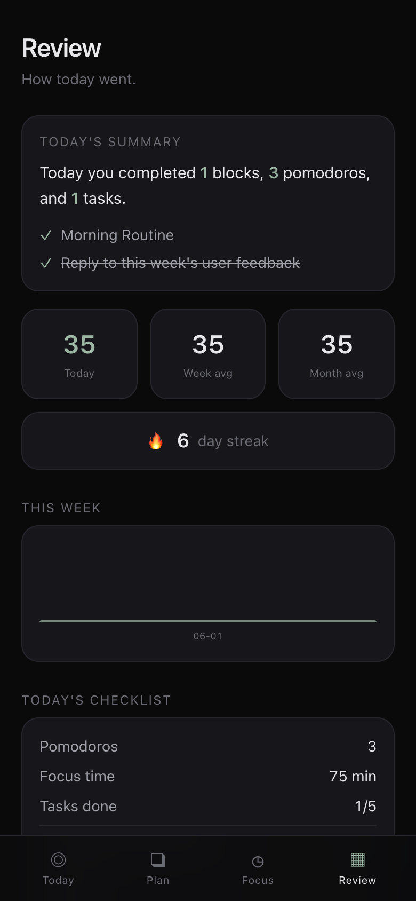

<div align="center">

# 🧠 Don't Think Mode

### The anti-productivity app for ADHD founders.

**Open it. Don't think. Just execute.**


**English** · [中文](./README.zh-CN.md)

<br/>

<table>
<tr>
<td align="center" valign="top" width="25%"><br/><sub><b>Today</b> · what's now</sub></td>
<td align="center" valign="top" width="25%"><br/><sub><b>Focus</b> · always running</sub></td>
<td align="center" valign="top" width="25%"><br/><sub><b>Plan</b> · AI-sorted tasks</sub></td>
<td align="center" valign="top" width="25%"><br/><sub><b>Review</b> · score → streak</sub></td>
</tr>
</table>

</div>

---

## The problem

Every productivity app you've ever tried hands you *more* decisions. Which list? Which view? What's next? Reorder, re-plan, re-prioritize. For an ADHD brain at 2pm, that friction isn't a feature — it's exactly where the day quietly dies.

You don't need another place to **organize** your life. You need something that just tells you what to do **right now** — while the clock is already ticking.

## The answer

Don't Think Mode shows you **one thing**: what's happening now, and how much time is left.

That's the entire home screen. No inbox. No backlog. No "where do I even start."

And the moment you step into a focus block — **the timer is already running.** There is no start button. That feeling that time is moving *with or without you*? That's not a bug. That's the whole product.

## Why it works for an ADHD brain

- ⏱️ **The timer never stops.** Enter a Deep Work block and a focus session auto-starts. No decision, no ramp-up, no "I'll start in 5 minutes." Momentum is the default state.
- 🎯 **One screen, one answer.** The home screen answers a single question — *what now?* — in one glance. Everything else is one tap away, and out of sight until you need it.
- 🤖 **AI sorts your day, you don't.** Dump today's tasks in raw. They get ranked against your goals — locally, or with your own OpenAI / Gemini key. You execute top-down and never agonize over priority again.
- 📈 **A score that becomes action.** Instead of a guilt-trip streak, it surfaces the *specific* high-value moves still left on the table today, so "do better" turns into "do this."
- ↩️ **Unfinished work rolls over.** Whatever you didn't close carries to tomorrow, automatically re-ranked. No cleanup, no shame spiral.
- 🍅 **Switch tasks, keep the clock.** Mid-session, tap any task to focus it next — the timer never resets, and every task keeps its own pomodoro count.
- 📸 **Share the day, not the to-do list.** One tap turns today into a clean card — save it to Photos, keep yourself honest.
- 📊 **Weekly & monthly recap.** See exactly what you actually shipped this week and this month, grouped by day — not just a number.
- 🌗 **Dark by default, light on demand.** A calm terminal-ish dark, or flip to light in one tap.
- 🔒 **Local-first — your data is yours.** Everything works offline in your browser, no tracking, ever. Opt into one-tap **cloud sync** (email + password, row-level-security) and it auto-saves and follows you across devices. Never "save" again.

## Design principles

1. **Remove choices, not features.** Every screen must answer *"what now?"* in one glance.
2. **Make time visible.** Countdowns over checklists. Momentum over planning.
3. **Local-first, always.** No login wall, no telemetry. Cloud sync is opt-in — and the app is fully usable without ever touching it.

## Quick start

```bash
npm install
npm run dev      # → http://localhost:4318
```

Then open it on your phone and **Add to Home Screen** — it installs as a standalone, offline-capable app.

### Optional: real LLM task sorting

The built-in heuristic ranker works with zero setup. Want an LLM instead? Paste an
OpenAI (`sk-…`) or Google Gemini (`AIza…`) key into **Settings → AI 排序**. The key
is stored only in your browser and used only to rank your task list — it never
leaves your device.

## Make it yours

The seed goals and daily rhythm are neutral defaults. Edit them in-app:

- **Goals** — your real priorities (the ranker weights tasks against these).
- **Schedule** — your blocks, deep-work windows, wake / sleep times.
- **Settings** — pomodoro lengths, display name, notifications.

Nothing leaves your device — unless you turn on cloud sync, and then only your own account can read it.

## Stack

- **Next.js 14** (App Router) · **TypeScript** · **Tailwind CSS**
- **Zustand** — persisted, local-first state
- **Supabase** — optional, RLS-secured cloud sync (off by default)
- **Installable PWA** — offline-capable, home-screen ready · iOS shell via **Capacitor**

## License

[MIT](./LICENSE) — do whatever you want with it.

<div align="center">

---

*Built for the brains that have a thousand tabs open — and just need the next one.*

</div>
